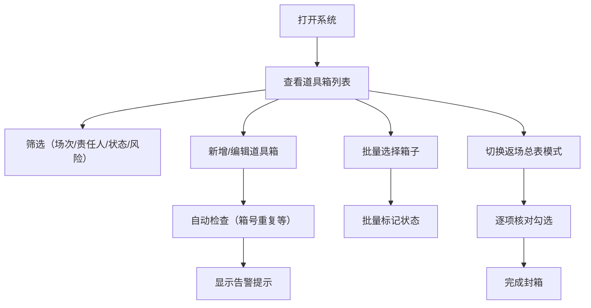

## 1. 产品概述

道具箱贴签与返场核对系统是为线下演出团队设计的纯前端工具，用于进出场时高效整理道具箱、记录贴签内容和核对返场清单。系统帮助团队避免道具遗漏、责任不清、高风险道具疏于管理等问题，提升演出前后的后勤效率。

## 2. 核心功能

### 2.1 用户角色
| 角色 | 注册方式 | 核心权限 |
|------|----------|----------|
| 道具管理员 | 无需注册，本地使用 | 全部功能：增删改道具箱记录、筛选、批量操作、查看核对清单 |
| 剧务人员 | 无需注册，本地使用 | 查看清单、标记状态、确认返场 |

### 2.2 功能模块
1. **主界面**：上半区道具箱表格、下半区详情与汇总，上下二分布局
2. **筛选功能**：按场次、责任人、状态、风险等级多维度筛选
3. **批量操作**：批量标记"待装箱""待返场""缺件待查""可封箱"
4. **自动检查**：箱号重复、返场备注缺失、同场次高风险箱过多、责任人负载不均
5. **返场总表模式**：专门输出当晚需要逐项勾核的清单

### 2.3 页面详情
| 页面名称 | 模块名称 | 功能描述 |
|---------|----------|----------|
| 主页面 | 顶部工具栏 | 新增道具箱、切换普通模式/返场总表模式、筛选器、批量操作按钮 |
| 主页面 | 道具箱表格（上半区） | 显示箱号、内容摘要、上场场次、脆弱提醒、返场状态、补件备注、责任人、风险等级，支持多选、行内编辑 |
| 主页面 | 详情编辑区（下半区左） | 编辑选中道具箱的完整信息，包含所有字段表单 |
| 主页面 | 汇总与告警区（下半区右） | 状态统计、自动检查告警、责任人负载图表、高风险提示 |
| 返场总表 | 核对清单 | 按场次分组的返场核对表，支持逐项勾选确认，显示箱号、内容、责任人、状态 |

## 3. 核心流程

用户打开系统后，首先看到道具箱列表表格。可以筛选查看特定场次或责任人的箱子，点击行查看详情并编辑。系统自动在汇总区显示异常告警。演出前可批量标记"待装箱"，演出后切换到"返场总表模式"逐项核对勾选，标记"可封箱"或"缺件待查"。

## 4. 用户界面设计

### 4.1 设计风格
- **主色调**：深靛蓝（#1e3a5f）作为主色，代表专业可靠
- **辅助色**：琥珀色（#f59e0b）用于高风险警告，翠绿色（#10b981）用于正常状态，玫瑰红（#ef4444）用于错误/缺件
- **中性色**：石板灰系列（#f8fafc, #f1f5f9, #e2e8f0, #94a3b8, #475569, #1e293b）
- **按钮风格**：微圆角（6px），带有微妙悬停阴影，实心主按钮配白色文字
- **字体**：标题使用 "Noto Sans SC" 粗体，正文使用 "Noto Sans SC" 常规，等宽字段（箱号）使用 "JetBrains Mono"
- **布局风格**：上下严格二分，上半区 55% 高度为表格，下半区 45% 高度分为左右两栏（详情 60%，汇总 40%）
- **视觉层次**：卡片式容器，细边框分割，关键数据使用色块突出
- **图标风格**：使用 lucide-react 线性图标，统一 18px 尺寸

### 4.2 页面设计概述
| 页面名称 | 模块名称 | UI 元素 |
|---------|----------|---------|
| 主页面 | 顶部工具栏 | 深色顶栏，左侧系统标题 + 模式切换按钮，右侧筛选器组 + 批量操作按钮组 |
| 主页面 | 道具箱表格 | 固定表头可滚动，斑马纹底色，选中行高亮，状态列带色块标签，风险等级带图标 |
| 主页面 | 详情编辑区 | 白色卡片，表单两列布局，必填字段星号标记，脆弱提醒和风险等级有特殊视觉提示 |
| 主页面 | 汇总与告警区 | 四个状态统计卡片 + 告警列表（带图标和严重程度色标） + 责任人负载条形图 |
| 返场总表 | 核对清单 | 按场次分组的折叠面板，每行带大尺寸勾选框，完成项灰色删除线样式 |

### 4.3 响应式
- 桌面端优先设计（≥1280px）
- 平板端（768-1279px）：上下布局保持，下半区改为上下堆叠而非左右
- 移动端（<768px）：表格简化为卡片列表，筛选器折叠到抽屉菜单
- 所有可点击区域确保 ≥44px 触摸尺寸

### 4.4 动效与交互
- 表格行悬停背景微变化（过渡 150ms）
- 状态标签切换有颜色渐变动画
- 告警出现时轻微抖动吸引注意
- 返场勾选时打勾动画 + 整行淡出为灰色
- 页面加载时内容区渐入（stagger 50ms）
