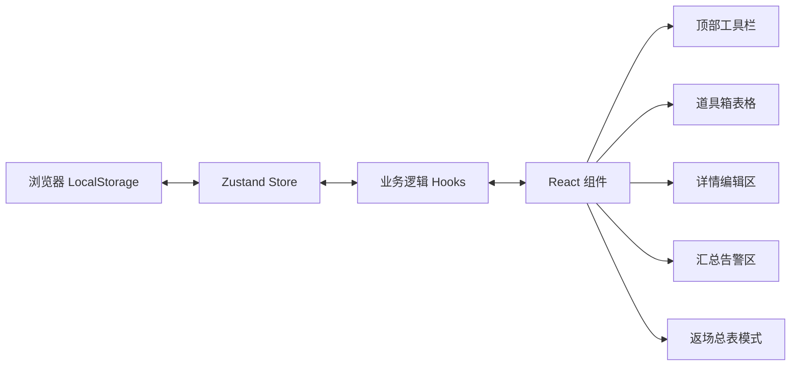
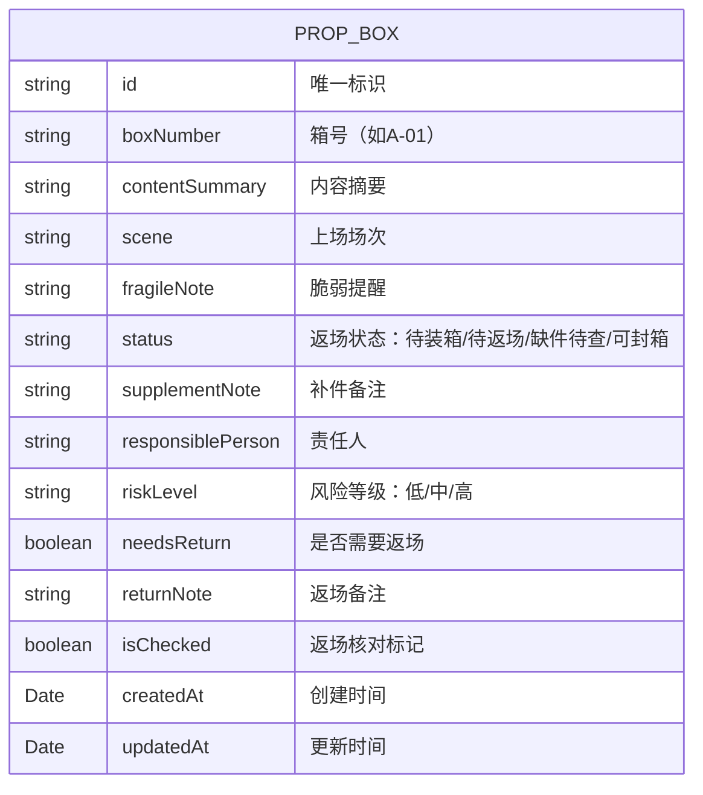

## 1. 架构设计

本项目为纯前端单页应用，无需后端服务，数据存储在浏览器 LocalStorage 中。整体采用 React 组件化架构，状态管理使用 Zustand，样式使用 Tailwind CSS。



## 2. 技术描述

- **前端框架**：React@18 + TypeScript
- **构建工具**：Vite@5
- **样式方案**：Tailwind CSS@3
- **状态管理**：Zustand@4
- **图标库**：lucide-react
- **数据持久化**：浏览器 LocalStorage
- **无后端、无数据库**：纯前端实现，数据本地存储

## 3. 路由定义

| 路由 | 用途 |
|------|------|
| / | 主页面（道具箱管理 + 返场总表模式切换） |

*单页应用，使用状态切换模式而非路由跳转*

## 4. 数据模型

### 4.1 数据模型定义



### 4.2 TypeScript 类型定义

```typescript
// 道具箱状态枚举
type BoxStatus = 'pending_pack' | 'pending_return' | 'missing_investigate' | 'ready_seal';

// 风险等级枚举
type RiskLevel = 'low' | 'medium' | 'high';

// 道具箱接口
interface PropBox {
  id: string;
  boxNumber: string;
  contentSummary: string;
  scene: string;
  fragileNote: string;
  status: BoxStatus;
  supplementNote: string;
  responsiblePerson: string;
  riskLevel: RiskLevel;
  needsReturn: boolean;
  returnNote: string;
  isChecked: boolean;
  createdAt: string;
  updatedAt: string;
}

// 筛选条件接口
interface FilterCriteria {
  scene: string;
  responsiblePerson: string;
  status: BoxStatus | '';
  riskLevel: RiskLevel | '';
}

// 告警类型
type AlertType = 'duplicate_box' | 'missing_return_note' | 'high_risk_excess' | 'unbalanced_load';

interface Alert {
  id: string;
  type: AlertType;
  severity: 'warning' | 'error';
  message: string;
  affectedBoxIds: string[];
}

// 应用状态接口
interface AppState {
  boxes: PropBox[];
  selectedBoxIds: string[];
  activeBoxId: string | null;
  filters: FilterCriteria;
  viewMode: 'normal' | 'checklist';
  alerts: Alert[];
}
```

### 4.3 状态管理 Store 设计

```typescript
// Zustand Store Actions
interface AppActions {
  // 道具箱 CRUD
  addBox: (box: Omit<PropBox, 'id' | 'createdAt' | 'updatedAt'>) => void;
  updateBox: (id: string, updates: Partial<PropBox>) => void;
  deleteBox: (id: string) => void;
  
  // 选择与批量操作
  toggleBoxSelection: (id: string) => void;
  selectAll: () => void;
  clearSelection: () => void;
  batchUpdateStatus: (ids: string[], status: BoxStatus) => void;
  
  // 筛选
  setFilters: (filters: Partial<FilterCriteria>) => void;
  resetFilters: () => void;
  
  // 视图模式
  setViewMode: (mode: 'normal' | 'checklist') => void;
  setActiveBox: (id: string | null) => void;
  
  // 自动检查
  runAutoCheck: () => Alert[];
  
  // 返场核对
  toggleCheck: (id: string) => void;
  
  // 持久化
  loadFromStorage: () => void;
  saveToStorage: () => void;
}
```

## 5. 组件结构

```
src/
├── components/
│   ├── Toolbar.tsx          # 顶部工具栏（新增、筛选、批量操作、模式切换）
│   ├── PropBoxTable.tsx     # 道具箱表格（上半区）
│   ├── DetailEditor.tsx     # 详情编辑区（下半区左）
│   ├── SummaryPanel.tsx     # 汇总与告警区（下半区右）
│   ├── ChecklistView.tsx    # 返场总表模式
│   ├── StatusBadge.tsx      # 状态标签组件
│   ├── RiskBadge.tsx        # 风险等级标签组件
│   └── AlertItem.tsx        # 告警项组件
├── store/
│   └── usePropStore.ts      # Zustand 状态管理
├── hooks/
│   └── useAutoCheck.ts      # 自动检查逻辑 Hook
├── types/
│   └── index.ts             # TypeScript 类型定义
├── utils/
│   ├── mockData.ts          # Mock 数据
│   └── storage.ts           # LocalStorage 工具
├── App.tsx                  # 主应用组件
├── main.tsx                 # 入口文件
└── index.css                # 全局样式 + Tailwind
```

## 6. 自动检查逻辑

1. **箱号重复检查**：遍历所有箱子，找出 `boxNumber` 重复的项
2. **返场备注缺失检查**：找出 `needsReturn === true` 但 `returnNote` 为空的箱子
3. **同场次高风险箱过多**：按场次分组，统计每组 `riskLevel === 'high'` 的数量，超过 3 个告警
4. **责任人负载不均**：按责任人分组统计箱子数量，计算标准差，超过阈值告警
